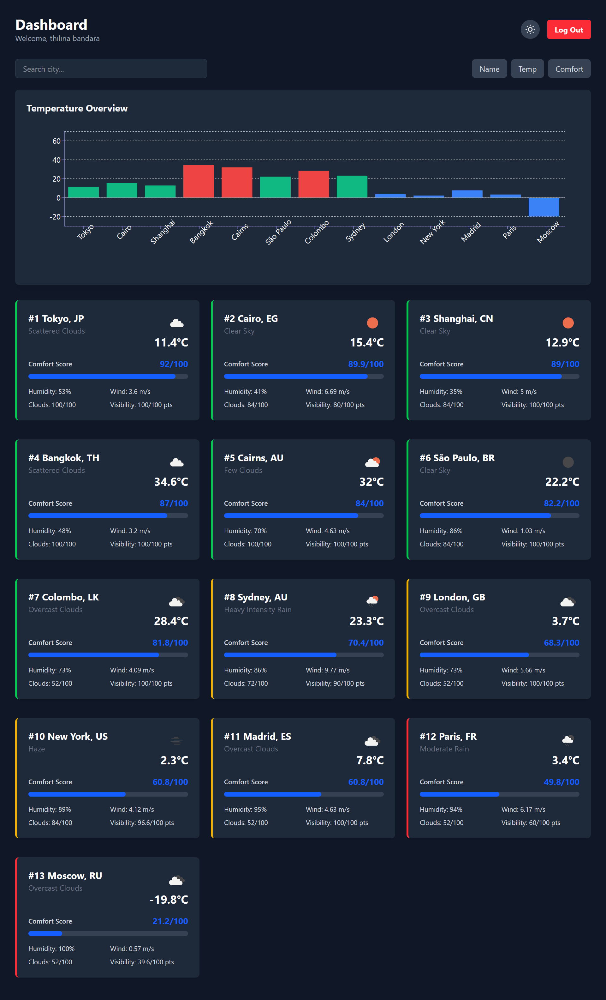
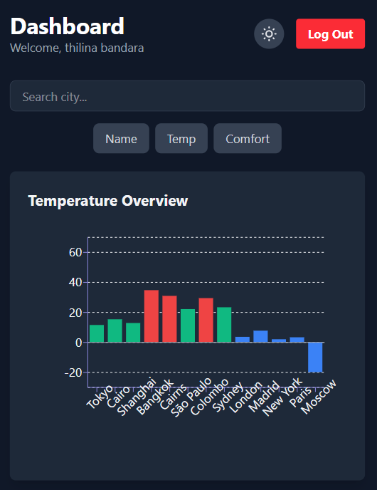
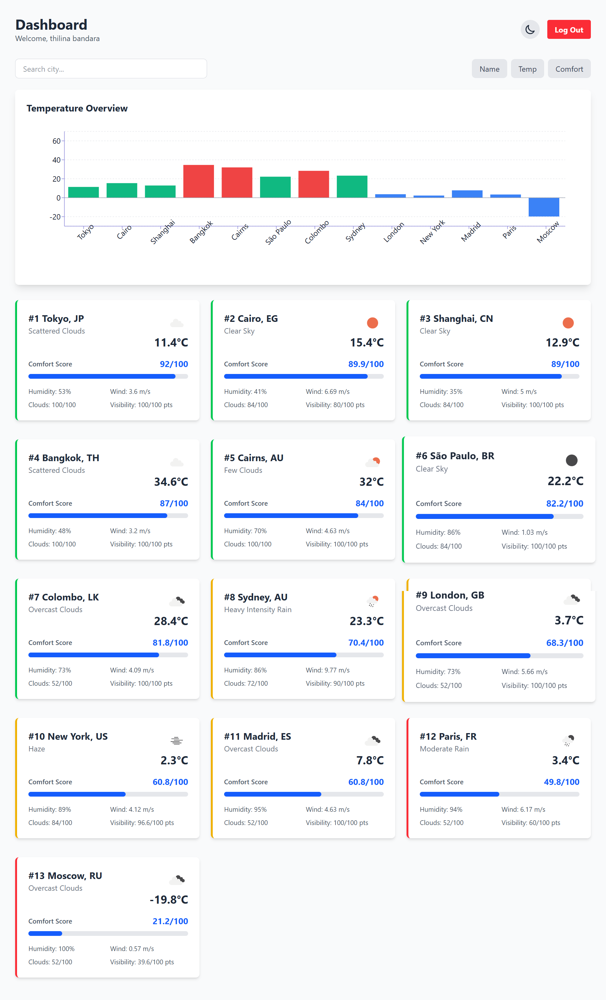

# Weather Analytics Application

A secure, responsive weather dashboard that ranks cities based on a custom "Comfort Index".

## 🚀 Setup Instructions

### Prerequisites
- Node.js (v18+)
- OpenWeatherMap API Key
- Auth0 Account (Tenant Domain + Client ID)

### 1. Backend Setup
```bash
cd backend
npm install
```
Create `backend/.env`:
```env
PORT=5000
OPENWEATHER_API_KEY=your_api_key
AUTH0_ISSUER_BASE_URL=https://your-domain.auth0.com/
AUTH0_AUDIENCE=your_api_identifier
```
Run Server:
```bash
npm run dev
```

### 2. Frontend Setup
```bash
cd frontend
npm install
```
Create `frontend/.env`:
```env
VITE_AUTH0_DOMAIN=your-domain.auth0.com
VITE_AUTH0_CLIENT_ID=your_client_id
VITE_AUTH0_AUDIENCE=your_api_identifier
VITE_API_URL=http://localhost:5000/api
```
Run Development Server:
```bash
npm run dev
```

---

## 🚀 Deployment

### Backend (Render/Heroku/Railway)
1. **Build Command**: `npm install`
2. **Start Command**: `npm start`
3. **Environment Variables**: Add all variables from `backend/.env`.

### Frontend (Vercel/Netlify)
1. **Framework Preset**: Vite
2. **Build Command**: `npm run build`
3. **Output Directory**: `dist`
4. **Environment Variables**: Add all variables from `frontend/.env`.

---

## 📸 Screenshots

| Dashboard | Mobile View |
|-----------|-------------|
|  |  |



> *Note: Please add `dashboard.png` and `mobile.png` to the `screenshots` folder.*

---

## 🌡️ Comfort Index Formula

The **Comfort Index (0–100)** determines how pleasant the weather feels for an average person.

### Formula
$$
\text{Score} = (T \times 0.35) + (H \times 0.25) + (W \times 0.20) + (C \times 0.10) + (V \times 0.10)
$$

### Reasoning
1. **Temperature (35%)**: The most critical factor for comfort.
   - *Ideal Range*: 18°C – 24°C.
   - Deviations from this range reduce the score significantly.
2. **Humidity (25%)**: High humidity amplifies heat; low humidity causes dryness.
   - *Ideal Range*: 40% – 60%.
3. **Wind Speed (20%)**: A light breeze (1-5 m/s) is pleasant. High winds are disruptive; stagnant air is uncomfortable.
4. **Cloudiness (10%)**: Subjective, but a mix of sun and clouds (20-40%) is generally preferred over overcast or scorching direct sun.
5. **Visibility (10%)**: Higher visibility implies cleaner, crisper air.

### Trade-offs
- **Dew Point vs Humidity**: Dew point is a better measure of "mugginess" but was omitted as it's not available in the standard OpenWeatherMap free tier response used here. Humidity is a reasonable proxy.
- **Pressure**: Excluded as its impact on daily comfort is subtle and hard to quantify linearly for a general score.

---

## ⚡ Caching Strategy (Backend)

To adhere to API rate limits and improve performance:
1. **Raw Cache (`raw_<cityId>`)**: Caches the direct response from OpenWeatherMap for **5 minutes**.
2. **Processed Cache (`all_cities_processed`)**: Caches the fully computed, sorted, and ranked list of cities for **5 minutes**.
   - This ensures that even if 1000 users hit the dashboard simultaneously, we only compute the expensive sorting logic once every 5 mins.

---

## 🔒 Security
- **Auth0 Integration**: User authentication is managed via Auth0.
- **Token Validation**: Backend validates JWTs (RS256) ensuring only authorized users can fetch weather data.
- **Environment Variables**: all secrets are kept in `.env` files (not committed).

---

## 📱 Features
- **Responsive Design**: Mobile-first grid layout.
- **Tailwind CSS**: Premium, clean UI with dark mode support.
- **Visual Feedback**: Loading spinners and error toasts.
